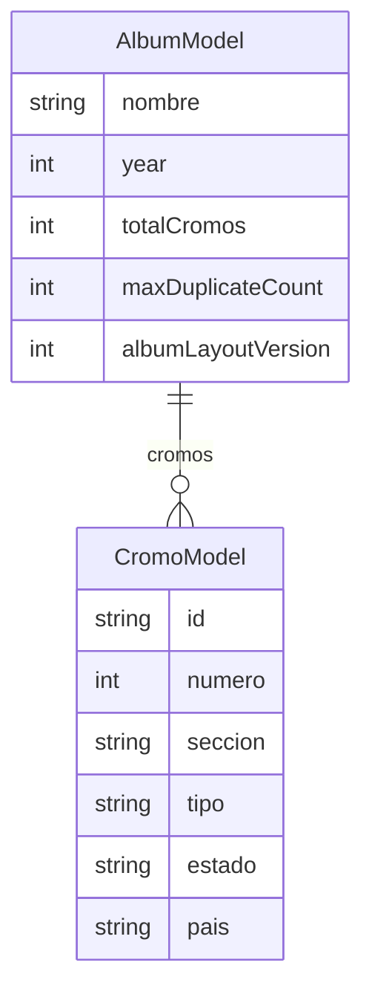

## Panini Mundial 2026 — datos de álbum oficiales (980 cromos) — Standard

## Overview

Sustituir el álbum demo de seis ítems (`createMockAlbum` en [`lib/data/mock_album_data.dart`](../../lib/data/mock_album_data.dart)) por un álbum coherente con la colección **Panini Copa Mundial de la FIFA 26™**: **980 láminas**, **48 selecciones** (12 grupos × 4 equipos), taxonomía de secciones en **español**, IDs estables `wc26-001` … `wc26-980`, y un **`albumLayoutVersion`** para poder alinear la numeración con el checklist oficial cuando exista sin romper futura persistencia por ID.

Contexto de producto y decisiones: [`docs/brainstorm/2026-04-18-mundial-2026-panini-album-official-data-brainstorm-doc.md`](../brainstorm/2026-04-18-mundial-2026-panini-album-official-data-brainstorm-doc.md).

## Problem Statement / Motivation

- El mock actual no refleja escala real (980 cromos), estructura por país/página ni totales que el usuario espera de un álbum Panini.
- Mantener ~980 `CromoModel` a mano en un solo archivo es frágil; hace falta una **definición declarativa** (equipos, bloques editoriales) y un **constructor puro** que materialice la lista.
- Hasta un PDF/checklist oficial, la numeración **1…980 por sección** será **provisional**; la app debe anclar confianza en **IDs estables**, no en que el `numero` coincida con el impreso en cada lámina.

## Proposed Solution

1. **Nuevo módulo de datos** (p. ej. bajo `lib/data/panini_wc26/` o similar), separado del demo mínimo:
   - **Declaración**: lista ordenada de los 48 equipos (grupos A–L, cuatro equipos por grupo) con nombres en español como en el brainstorm; bloques para las **20 láminas no ligadas a equipos** (estadios, calendario, historia, camino, récords, introducción, etc.) con **rangos o recuentos** acordados en el plan de implementación.
   - **Función pura** `AlbumModel buildPaniniMundial2026Album()` (nombre exacto ajustable) que:
     - Genera exactamente **980** `CromoModel` con `numero` **1…980** (provisional, agrupado por bloques hasta checklist).
     - Asigna `id` = `wc26-001` … `wc26-980` (padding tres dígitos).
     - Rellena `seccion`, `tipo` (`normal` vs `CromoModel.tipoSpecial` para escudos en material especial según el brainstorm), `pais` donde aplique, `estado` inicial homogéneo (p. ej. todos `missing` salvo que se decida otro default explícito).
   - Constante **`albumLayoutVersion`** (entero, p. ej. `1`): exponerla en el álbum (ver *Technical considerations*).

2. **Cableado de la app**: en [`lib/app/cromos_tracker_app.dart`](../../lib/app/cromos_tracker_app.dart), el `AlbumCubit` por defecto usa el nuevo builder en lugar de `createMockAlbum()`.

3. **Retener** `createMockAlbum` y/o `createNoSwapAlbum` solo si siguen siendo útiles para tests ligeros; si no, sustituir referencias por factories pequeñas en tests para no cargar 980 cromos donde no haga falta.

## Technical Considerations

### Modelo y metadatos

- Evaluar añadir **`albumLayoutVersion`** a [`AlbumModel`](../../lib/models/album_model.dart) (campo `int`, requerido con default `1` o opcional) para que tests y futura persistencia lean la misma versión. Alternativa mínima: constante de biblioteca junto al builder **sin** tocar `AlbumModel` en esta PR — documentar trade-off (menos visibilidad en capa dominio).
- **No** introducir aún assets de carátulas ni persistencia; solo datos en memoria.

### Orden de secciones en la UI

En [`album_page.dart`](../../lib/features/album/view/album_page.dart), `_groupBySection` construye un mapa con **orden de inserción**: el orden de las cabeceras de sección sigue la **primera aparición** de cada `seccion` en `album.cromos`. El generador debe emitir cromos en un orden que produzca **orden de sección estable y documentado** (p. ej. Intro / bloques globales → Grupo A … → … → extras editoriales).

### Iconos por sección

`_sectionIcon` usa heurísticas por substring (`estadio`, `grupo`, `fase`, …). Al definir nombres de `seccion` en español, comprobar que las nuevas etiquetas sigan disparando iconos razonables o ampliar el mapa de forma acotada.

### Estadísticas (`AlbumStats`)

[`AlbumStats.fromAlbum`](../../lib/data/album_stats.dart) cuenta **especiales** como cantidad de cromos con `tipo == CromoModel.tipoSpecial` en **todo el álbum**, no “especiales conseguidos”. A escala 980, conviene **alinear copy en Stats** con esta semántica o acotar el alcance en esta entrega (ver *Dependencies & Risks*).

### Paralelas / “20 extras” vs “20 editoriales”

El artículo Panini distingue **20 láminas de contenido no por equipo** (980 − 960) de las **20 láminas extra de jugadores en acción** (variantes/inserciones). El plan de implementación debe **separar** bloques de datos y comentarios en código para no fusionar ambos conceptos; si las paralelas **no** forman parte del set base 1…980, **no** mezclarlas en el mismo listado hasta decisión explícita.

### Diagrama de datos (álbum → cromos)

*(Si `albumLayoutVersion` no se añade al modelo, omitir ese campo en el diagrama y documentar la constante en capa datos.)*

## Acceptance Criteria

- [ ] `buildPaniniMundial2026Album()` (o nombre final acordado) devuelve `AlbumModel` con **exactamente 980** cromos, `totalCromos == 980`, **IDs únicos** `wc26-001` … `wc26-980`.
- [ ] **48 secciones de equipo** (o convención explícita documentada: p. ej. una `seccion` por “Grupo X — Nombre país”) con **20 cromos cada una**, más **20 cromos** para bloques no-equipo, sumando 980 — coherente con el anexo aritmético del brainstorm.
- [ ] Lista de equipos **alineada** con el sorteo / grupos del brainstorm; comentario en código con enlace a validación FIFA ([standings](https://www.fifa.com/en/tournaments/mens/worldcup/canadamexicousa2026/standings)).
- [ ] `albumLayoutVersion` definida y **test de regresión** que fije versión + totales (980), sin depender del mock de 6 ítems para invariantes globales.
- [ ] Tests existentes actualizados: [`test/data/album_stats_test.dart`](../../test/data/album_stats_test.dart) (deja de asumir `totalCromos == 6` en el fixture mock si el mock cambia); cualquier test que importe `createMockAlbum` revisado.
- [ ] **Determinismo**: orden de `cromos` y de secciones en UI **reproducible** entre ejecuciones (sin depender de iteración no ordenada de mapas en el generador).
- [ ] Documentar en comentario breve (código o doc interno del módulo) que la **numeración 1…980 es provisional** hasta checklist Panini.

## Success Metrics

- Tests unitarios verdes con invariantes de versión y conteo.
- Lista de 980 cromos navegable en la app sin errores de build; perfil manual razonable en dispositivo medio (sin prescripción de FPS en esta entrega salvo regresión obvia).

## Dependencies & Risks

| Riesgo | Mitigación |
|--------|------------|
| Checklist oficial cambia orden de números | IDs estables + subir `albumLayoutVersion` y reglas de migración cuando exista persistencia |
| Confundir “20 editoriales” con paralelas | Bloques de datos y comentarios separados; no igualar cantidades sin fuente |
| Stats “Especiales” malinterpretado | Ajustar etiquetas en UI o documentar que es “cromos tipo special en el álbum” |
| Sección / iconos | Probar nombres de `seccion` con `_sectionIcon` |

## User flow & UX notes (from analysis)

- **Confianza**: considerar una línea de copy eventual (settings o pie de álbum) de que la numeración es provisional — fuera de alcance mínimo si no se pide producto.
- **Completar colección**: en “Faltantes” vacío el mensaje es genérico (“Nada que mostrar”); paridad con el empty state de Intercambios es mejora opcional posterior.
- **Escala 980**: búsqueda / salto a número no existe; el comentario en `album_page` ya apunta a `SliverChildBuilderDelegate` si hay jank — backlog.

## Implementation suggestions (ordered)

1. Añadir o fijar `albumLayoutVersion` (modelo o constante de módulo).
2. Implementar declaración 48 equipos + bloques de 20 láminas globales con números por bloque acordados (provisional).
3. Implementar builder + tests de invariantes.
4. Conectar `CromosTrackerApp` al nuevo builder; ajustar/eliminar `createMockAlbum` según estrategia de tests.
5. Pasar `flutter test`; revisión manual de orden de secciones e iconos.

## References & Research

- Brainstorm: [`docs/brainstorm/2026-04-18-mundial-2026-panini-album-official-data-brainstorm-doc.md`](../brainstorm/2026-04-18-mundial-2026-panini-album-official-data-brainstorm-doc.md)
- Panini (formato colección): [¿Cuántas páginas y stickers tiene el Álbum Panini 2026?](https://paninitienda.com/blogs/mundial-2026/cuantas-paginas-y-stickers-tiene-el-album-panini-mundial-2026)
- FIFA standings: [2026 World Cup](https://www.fifa.com/en/tournaments/mens/worldcup/canadamexicousa2026/standings)
- Código tocado: [`lib/data/mock_album_data.dart`](../../lib/data/mock_album_data.dart), [`lib/models/album_model.dart`](../../lib/models/album_model.dart), [`lib/models/cromo_model.dart`](../../lib/models/cromo_model.dart), [`lib/app/cromos_tracker_app.dart`](../../lib/app/cromos_tracker_app.dart), [`lib/features/album/view/album_page.dart`](../../lib/features/album/view/album_page.dart)

## Open questions (to resolve during implementation)

1. ¿**Solo** numeración provisional por bloques hasta PDF, o bloquear hasta tener orden oficial?
2. ¿Las láminas “extra jugadores en acción” entran en el **980** o van como paralelas fuera del listado principal?
3. ¿`AlbumStats.specialsCount` debe mantener semántica actual o evolucionar a “especiales en colección”?

---

**Local research note:** El repositorio ya usa `CustomScrollView` + `SliverGrid` por sección; no se requiere cambio de UI para “soportar” 980 ítems salvo hallazgos de rendimiento o de orden de secciones.
